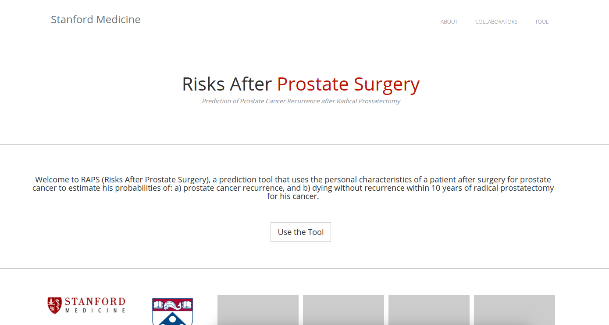

# RAPS

Risk After Prostate Surgery Shiny [Web Application](http://predict.shinyapps.io/raps), [Dockerized](https://hub.docker.com/r/vanessa/prostate-raps).

We have developed a tool called RAPS (Risks After Prostate Surgery) that uses a man’s personal characteristics to estimate his probability of: a) prostate cancer recurrence, and b) dying without recurrence within 10 years of radical prostatectomy for his cancer.

# Docker Run Instructions

The application has been dockerized, meaning that it can be deployed locally with Docker. You should first install the [docker engine](https://docs.docker.com/engine/installation/) and [docker-compose](https://docs.docker.com/compose/install/) for your platform, and then clone the repo, and run the application:

      git clone https://github.com/vsoch/prostate-docker
      cd prostate-docker
      docker-compose up -d

Then open up your browser to `127.0.0.1:3838` to use the application. If you want to edit and rebuild the image:

     docker-compose stop
     docker-compose rm
     docker build -t vanessa/prostate-raps .
     docker-compose up -d

or if you want to log directly into the container (to use the R installed with all packages, etc.), first use `docker ps` to get the container ID, and then use `docker exec` to connect to the container:

     docker exec -it (CONTAINER-ID) bash

If you are interested in the codebase to deploy to [http://shinyapps.io](http://shinyapps.io) please see the [prostate](https://github.com/vsoch/prostate) repo. Please post to an [issue](http://www.github.com/vsoch/prostate-docker/issues) if you have questions or other issues with the code.
